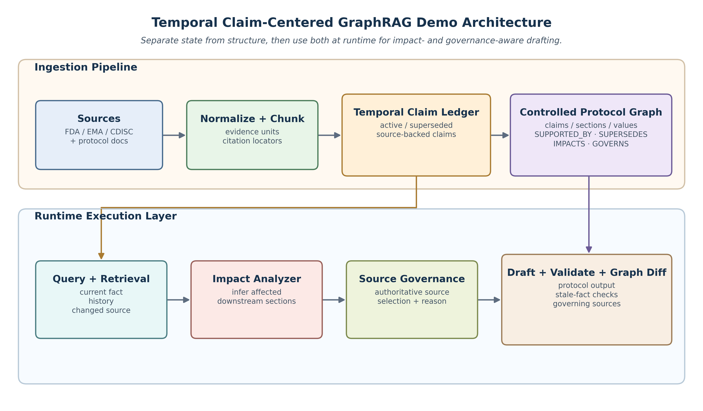
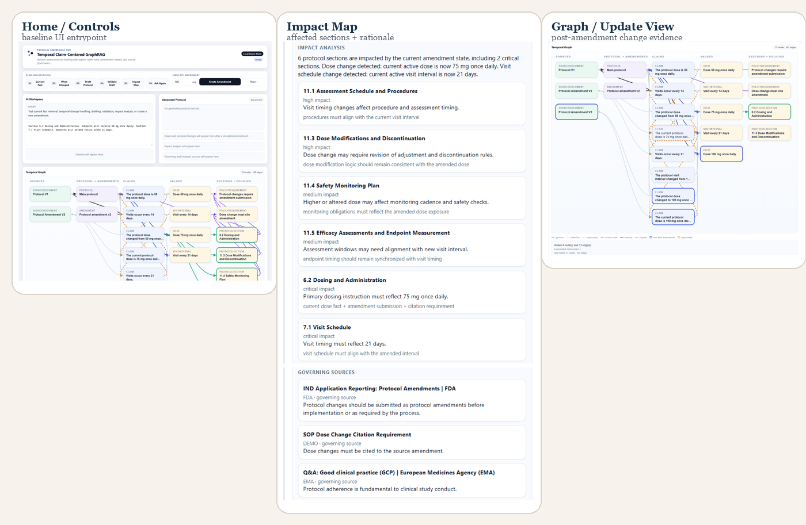
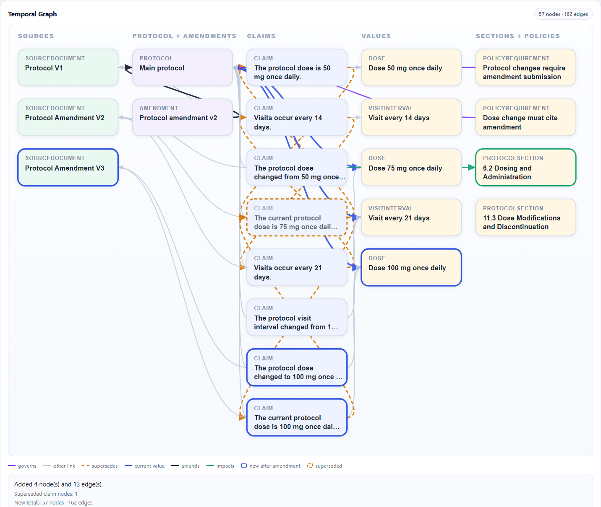

# ProtoTrace

**Amendment-sensitive clinical-protocol drafting, built around one separation: state is
tracked explicitly, structure is tracked explicitly, and neither is inferred fresh from
retrieved text on every question.**

When a clinical protocol is amended, downstream documents are often drafted from a
collection that contains both the current fact and the version it replaced. A drafting
tool built on plain retrieval can't reliably tell which one is active, what else the
amendment affects, or which authority governs the change. ProtoTrace keeps that
information in two explicit structures instead of re-deriving it from text every time:

- a **temporal claim ledger** that records every fact as `active` or `superseded`, with
  a direct link to its predecessor and its source; and
- a **controlled graph** that links claims to amendment events, protocol sections, and
  governing sources.

## Architecture



- **Ingestion**: official FDA/EMA/ICH/CDISC pages and protocol documents are normalized
  and chunked into evidence units. For the shipped demo and benchmark, claims are a
  curated fixture — each one is linked to a cited source span, typed, and given a state.
  Automated extraction code exists but isn't used to claim extraction accuracy here.
- **Temporal ledger**: factual, change-event, requirement, and recommendation claims.
  Every factual claim is `active` or `superseded`, with a `supersedes_claim_id` pointer
  to its direct predecessor — so "what was the dose before this?" is a traversal, not a
  re-ranking over every historical mention.
- **Graph**: nodes and edges for protocols, amendments, claims, values, sections,
  evidence sources, and governing policies. Simulating an amendment appends a claim,
  supersedes the previous one, and rebuilds the graph so the delta is visible, not
  hidden inside regenerated prose.
- **Runtime**: direct state questions traverse the ledger; impact analysis follows
  `IMPACTS` edges from a changed subject to protocol sections; governance follows
  `GOVERNS` edges to the citing authority; drafting and validation both work only off
  active claims.

## Install

```powershell
python -m pip install -e .
```

No credentials are required for the local demo or the deterministic evaluations. Azure
OpenAI credentials (`.env.example`) are only needed for the optional LLM-baseline
comparisons.

## Run the demo

```powershell
python scripts/reset_demo_baseline.py
python scripts/run_demo_ui.py
```

Open `http://127.0.0.1:8000` (or whatever port the launcher prints). The baseline starts
at a 75 mg dose, established by one prior amendment.



Six linked actions: ask the current fact (sourced, not the superseded value); ask what
changed (the full transition plus lineage); generate a source-linked draft; validate a
stale draft (flags the outdated value and the missing citation); view the impact map
(downstream sections + governing sources); and simulate a new amendment live.



Simulating an amendment supersedes the prior claim and updates the graph in place — new
amendment/dose nodes, a supersession edge, and a rerouted current-value path, so the
state transition is something you can point at, not something you have to infer from
before/after text.

## Results

All numbers below are reproducible from the data in this repo (see
[Reproduce results](#reproduce-results)); each table links the script/data file that
produced it.

### Controlled benchmark (55 synthetic amendment chains, mechanically-derived gold)

Three amendment types (dose, visit-interval, eligibility-criterion) plus 8
source-grounded rule questions. Gold is generated deterministically from the known
amendment sequence, so this is a construction/regression test, not a generalization
result — every method reaches perfect current-state lookup; the differences show up in
ordered history and rule recovery, where free-text answers penalize exact-match scoring.

| Method | Current | Prev. | Dose Hist. | Visit Hist. | Elig. Hist. | Rule | Citation F1 |
|---|---|---|---|---|---|---|---|
| ProtoTrace (claim graph) | 1.000 | 1.000 | 1.000 | 1.000 | 1.000 | 1.000 | 0.986 |
| Version-aware lexical proxy | 1.000 | 0.967 | 0.000 | 1.000 | 1.000 | 0.125 | 0.627 |
| RAG (GPT-4o, no ledger) | 1.000 | 1.000 | 0.867 | 0.000 | 0.000 | 0.000 | 0.874 |

Source: `data/eval/test_dataset.json`, `data/eval/paper_summary.json`.

### Real-data check: ClinicalTrials.gov changed-module detection

1,902 consecutive amendment transitions across 111 real ClinicalTrials.gov studies.
Gold is the registry's own declared changed-module labels — external to this project.
The detector is a structured-field comparison component, not the full drafting system.

| Method | Precision | Recall | F1 |
|---|---|---|---|
| Structured field comparison | **1.000** | 0.769 | 0.780 |
| Predict-all baseline | 0.299 | **1.000** | 0.435 |

Precision is 1.000 by construction (the detector only ever fires on a field it
explicitly compares, so every firing is a real registry-declared change); the recall gap
is bounded by registry modules genuinely outside the five tracked fields.

Source: `data/eval/ctgov_eval_results.json`, `data/eval/ctgov_amendment_benchmark.json`.

### Independent human pilot: impact/governance judgments

ProtoTrace's own deterministic impact/governance rules cover 2 of 8 possible amendment
archetypes (dose, visit-interval) by design — validated first before extending. Two
independently annotated pools (single annotator, not involved in building the rules,
blind to system output; no inter-annotator agreement yet — see
`data/pilot_annotation/README.md` for the full annotation protocol and a caveat on
effective sample size) check two different things:

| System | Archetypes | Impact F1 | Governance F1 | Pool |
|---|---|---|---|---|
| ProtoTrace rules (2-archetype) | 2/8 | 1.000\* | 1.000\* | own mechanically-derived gold |
| GPT-4o-mini (text baseline) | 8/8 | 0.715 | 0.702 | pool 1, independent gold |
| ProtoTrace rules (8-archetype) | 8/8 | 0.926 | 0.865 | pool 2, held-out independent gold |

\*Not comparable across rows: row 1 is scored on ProtoTrace's own construction-derived
gold (§ controlled benchmark above); rows 2-3 are scored on independently annotated
gold the rule/baseline logic never saw. The 8-archetype rules (`pilot_rule_engine.py`)
were written without consulting pool 1's labels and scored only on pool 2, specifically
to avoid fitting rules to gold already seen.

Source: `data/eval/pilot_llm_baseline_results.json`,
`data/eval/heldout_rule_engine_results.json`, `data/pilot_annotation/`.

### Sequential update stability

Across chains of up to 4 sequential amendments, both the claim graph and the lexical
proxy retain the correct active dose. The architectural difference is observability:
each claim-graph update adds ~3.98 nodes and ~12.98 edges to the exported graph (2 new
claims per step) with an explicit edge delta, at ~3.5 ms average query latency versus
~1.6 ms for the proxy's plain retrieval — the proxy re-answers over text with no
persistent update structure to inspect.

Source: `data/eval/update_stability_results.json`.

## Reproduce results

```powershell
python scripts/reproduce_paper_eval.py
python -c "from kg_demo.ctgov_eval import run_ctgov_eval; run_ctgov_eval(use_llm=False)"
python scripts/run_pilot_annotation_eval.py   # calls Azure OpenAI (gpt-4o-mini); needs .env
python scripts/run_heldout_eval.py            # deterministic, no API calls
```

The controlled-benchmark table uses only deterministic methods by default. Optional
Azure OpenAI comparisons fail closed: a failed call is never silently replaced by a
heuristic under a model's name, and cached results carry explicit backend/model
provenance.

## Test

```powershell
$env:PYTHONPATH = (Resolve-Path src)
python -m unittest discover -s tests -p "test_*.py" -v
```

## Data

- `data/normalized/` — official FDA/EMA/ICH/CDISC pages, normalized with source URLs.
- `data/eval/` — benchmark definitions and result artifacts (JSON + human-readable MD).
- `data/pilot_annotation/` — the two independently annotated pools described above.
- The protocol/amendment content itself is synthetic; regulatory reference material is
  real, sourced from official pages.
- The real-data check uses public ClinicalTrials.gov version histories and
  registry-declared changed-module labels.

## License

MIT — see `LICENSE`.

Never commit `creds.env`, `.env`, connection strings, or API keys. Use `.env.example`
as the configuration template.
